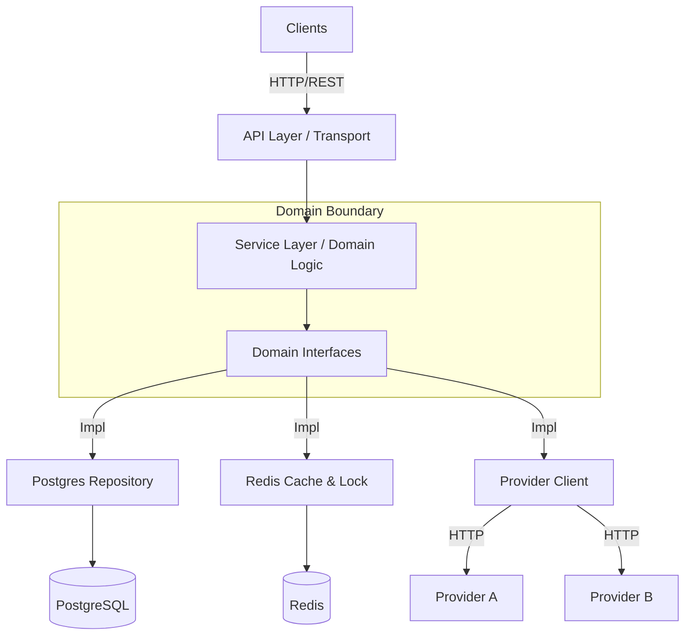
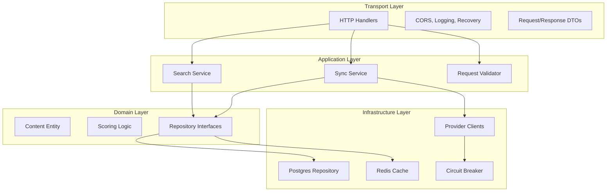
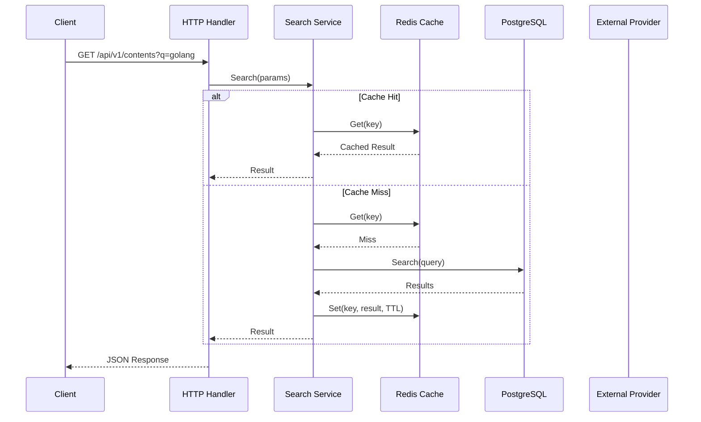
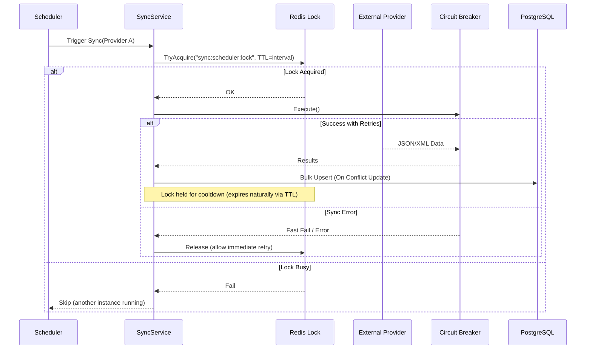

# Architecture & Design

## High-Level Architecture

The Search Engine Service follows a **Ports & Adapters (Hexagonal)** architecture to decouple business logic from
external dependencies.



## Component Layers



## Request Flow Sequence



## Data Sync Flow

Content is fetched periodically from external providers to keep our DB up-to-date.



**Locking Behavior:**
- **Success**: Lock held for `interval` duration (cooldown) - expires naturally via TTL
- **Error**: Lock released immediately to allow retry by another instance
- **Busy**: Skip execution if another pod holds the lock

## 🧮 Content Scoring Formula (Popularity)

Before ranking occurs, every content item is assigned a `score` based on its interaction metrics and freshness. This
score is calculated in the application logic (`internal/domain/scoring.go`) during sync with providers.

**Final Score** = `(Base Score * Type Coefficient) + Recency Score + Interaction Score`

### 1. Base Score

- **Video**: `views / 1000 + (likes / 100)`
- **Article**: `reading_time + (reactions / 50)`

### 2. Type Coefficient

- **Video**: `1.5` (Higher weight for rich media)
- **Article**: `1.0`

### 3. Recency Score (Freshness Bonus)

- **< 1 week**: `+5`
- **< 1 month**: `+3`
- **< 3 months**: `+1`
- **Older**: `+0`

### 4. Interaction Score (Engagement Quality)

- **Video**: `(likes / views) * 10`
- **Article**: `(reactions / reading_time) * 5`

---

## 🧠 Hybrid Ranking Algorithm (Search)

The core of our search experience is a custom ranking formula that balances **Semantic Relevance** with the **Content
Score** calculated above. This ensures that "viral" but irrelevant content doesn't drown out perfectly matching results,
and vice versa.

### The Formula

The final rank is calculated dynamically in PostgreSQL:

```
FinalRank = ts_rank(Vector, Query) × log10(CalculatedScore + 10)
```

### Logic Breakdown

1. **Text Relevance (`ts_rank`)**:
    * Uses PostgreSQL's Full-Text Search on a weighted `tsvector`.
    * **Weighting Strategy**:
        * **Title**: Weight `A` (Highest priority, ~1.0).
        * **Tags**: Weight `B` (Medium priority, ~0.4).
    * This ensures that a keyword match in the **Title** signals higher relevance than a match in the **Tags**.
    * Acts as a **Veto Factor**: If the relevance is `0`, the total score is `0`.

2. **Popularity Normalization (`Logarithmic Scale`)**:
    * Raw popularity scores (views, likes, etc.) can range from 0 to millions.
    * We use $\log_{10}$ to dampen this variance. A video with 1M views is better than one with 100 views, but not
      10,000x better in terms of relevance.

3. **Smoothing (`+ 10`)**:
    * Handles the "Cold Start" problem.
    * New content (Score 0) gets a multiplier of $\log(10) = 1$, effectively relying 100% on text relevance.
    * Prevents negative multipliers.

### Verification

The correctness of this ranking logic is strictly verified via **Integration Tests** (`TestScoring`). These tests run
against a real PostgreSQL container to ensure that the `ts_rank` and logarithmic formulas behave exactly as specified in
the design.

### Performance Optimization

The logarithmic score calculation is cached in a **stored computed column** (`log_score_cached`) to avoid computing
`LOG()` on every row during sorting.

**Implementation**:

- PostgreSQL `GENERATED ALWAYS AS ... STORED` computes the value once on insert/update
- B-tree index on `log_score_cached DESC` enables efficient sorted retrieval
- GORM uses the `-` tag to exclude the field from INSERT/UPDATE statements

**Performance Impact** (100K rows):

| Metric         | Before  | After  | Improvement      |
|----------------|---------|--------|------------------|
| Execution Time | 475.8ms | 37.8ms | **12.6x faster** |
| Sort Stage     | 475.4ms | 37.2ms | **12.8x faster** |

The optimization eliminates per-row `LOG()` calculation during sorting, using pre-computed values from the index
instead.

---

## 🛡 Distributed System Patterns

### 1. Retry Mechanism (Transient Failures)

We use **Resty's** built-in retry mechanism to handle temporary hiccups (e.g., network blips).

**Configuration** (per provider):

```yaml
retry:
  max_attempts: 3        # Maximum retry attempts
  wait_time: 1s          # Initial wait time
  max_wait_time: 5s      # Maximum wait time between retries
```

**Backoff Strategy**: Exponential backoff with jitter

The retry mechanism uses exponential backoff with random jitter to prevent thundering herd problems when multiple pods
retry simultaneously:

1. **First retry**: Wait ~1s (with jitter)
2. **Second retry**: Wait ~2s (exponential increase with jitter)
3. **Third retry**: Wait up to 5s (capped at max_wait_time)

**Integration**: Retries happen *inside* the circuit breaker. If retries are exhausted, the final error counts toward
tripping the circuit breaker.

---

### 2. Circuit Breakers (Resilience)

We utilize `sony/gobreaker` to prevent cascading failures when external providers are down.

* **Isolation**: Each provider (A, B) has its own independent circuit breaker.
* **States**: Closed (normal), Open (failing), Half-Open (testing recovery)
* **Behavior**: If Provider A fails repeatedly, the breaker trips to `OPEN` state, fast-failing requests to A while
  allowing Provider B to continue serving results.
* **Recovery**: The breaker automatically tests connectivity in `HALF-OPEN` state before fully recovering.

**Configuration** (per provider):

```yaml
circuit_breaker:
  max_requests: 3         # Max requests in half-open state
  interval: 60s           # Statistical interval
  timeout: 30s            # Open state timeout
  failure_ratio: 0.5      # 50% failure rate to trip
```

---

### 3. Distributed Locking (Concurrency)

To support horizontal scaling, we cannot rely on in-memory locks for background jobs.

* **Tool**: `redsync` (Redis-based distributed lock using Redlock algorithm)
* **Use Case**: The **Sync Worker** runs on every replica, but we only want *one* active sync job at a time.
* **Mechanism**: Workers attempt to acquire a lock with a TTL. If failed (lock exists), they skip the job.

**Lock Key Format**: `sync:scheduler:lock`
**Lock TTL**: Equals `sync.interval` (cooldown model) - lock expires naturally on success, released immediately on error

**Cooldown Behavior**:
- Success → Lock held for full interval (prevents duplicate syncs)
- Error → Lock released immediately (allows retry)
- TTL expiration → Automatic release if sync exceeds timeout

---

### 4. Caching Strategy

* **Search Results**: High-traffic search queries are cached in Redis with a configurable TTL (default 15 min).
* **Key Design**: `{prefix}:search:{query}:{type}:{page}:{page_size}:{sort_by}:{sort_order}`
* **Invalidation**: Cache is naturally expired via TTL. We favor eventual consistency for search results.
* **Cache Miss Handling**: On cache miss, the service queries PostgreSQL and populates the cache for future requests.
