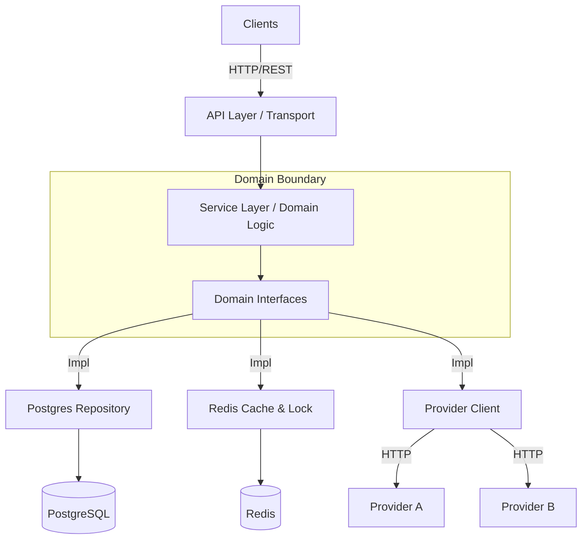
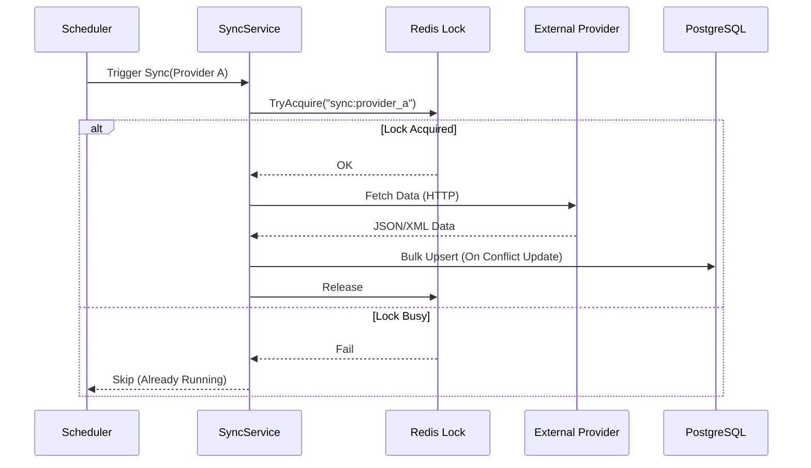

# Architecture & Design

## High-Level Architecture

The Search Engine Service follows a **Ports & Adapters (Hexagonal)** architecture to decouple business logic from external dependencies.

## 🧮 Content Scoring Formula (Popularity)

Before ranking occurs, every content item is assigned a `score` based on its interaction metrics and freshness. This score is calculated in the application logic (`internal/domain/scoring.go`) during sync with providers.

**Final Score** = `(Base Score * Type Coefficient) + Recency Score + Interaction Score`

### 1. Base Score
- **Video**: `views / 1000 + (likes / 100)`
- **Article**: `reading_time + (reactions / 50)`

### 2. Type Coefficient
- **Video**: `1.5` (Higher weight for rich media)
- **Article**: `1.0`

### 3. Recency Score (Freshness Bonus)
- **< 1 week**: `+5`
- **< 1 month**: `+3`
- **< 3 months**: `+1`
- **Older**: `+0`

### 4. Interaction Score (Engagement Quality)
- **Video**: `(likes / views) * 10`
- **Article**: `(reactions / reading_time) * 5`

---

## 🧠 Hybrid Ranking Algorithm (Search)

The core of our search experience is a custom ranking formula that balances **Semantic Relevance** with the **Content Score** calculated above. This ensures that "viral" but irrelevant content doesn't drown out perfectly matching results, and vice versa.

### The Formula

The final rank is calculated dynamically in PostgreSQL:

$$
FinalRank = \text{ts\_rank}(Vector, Query) \times \log_{10}(\text{Score} + 10)
$$

### Logic Breakdown

1.  **Text Relevance (`ts_rank`)**:
    *   Uses PostgreSQL's Full-Text Search on a weighted `tsvector`.
    *   **Weighting Strategy**:
        *   **Title**: Weight `A` (Highest priority, ~1.0).
        *   **Tags**: Weight `B` (Medium priority, ~0.4).
    *   This ensures that a keyword match in the **Title** signals higher relevance than a match in the **Tags**.
    *   Acts as a **Veto Factor**: If the relevance is `0`, the total score is `0`.

2.  **Popularity Normalization (`Logarithmic Scale`)**:
    *   Raw popularity scores (views, likes, etc.) can range from 0 to millions.
    *   We use $\log_{10}$ to dampen this variance. A video with 1M views is better than one with 100 views, but not 10,000x better in terms of relevance.

3.  **Smoothing (`+ 10`)**:
    *   Handles the "Cold Start" problem.
    *   New content (Score 0) gets a multiplier of $\log(10) = 1$, effectively relying 100% on text relevance.
    *   Prevents negative multipliers.

### Verification
The correctness of this ranking logic is strictly verified via **Integration Tests** (`TestScoring`). These tests run against a real PostgreSQL container to ensure that the `ts_rank` and logarithmic formulas behave exactly as specified in the design.

## 🛡 Distributed System Patterns

### 1. Circuit Breakers (Resilience)
We utilize `sony/gobreaker` to prevent cascading failures when external providers are down.
*   **Isolation**: Each provider (A, B) has its own independent circuit breaker.
*   **Behavior**: If Provider A fails repeatedly, the breaker trips to `OPEN` state, fast-failing requests to A while allowing Provider B to continue serving results.
*   **Recovery**: The breaker automatically tests connectivity in `HALF-OPEN` state before fully recovering.

### 2. Retries (Transient Failures)
We use **Resty**'s built-in retry mechanism to handle temporary hiccups (e.g., network blips).
*   **Policy**: Exponential Backoff with Jitter.
*   **Config**: Defined per provider (default 3 retries).
*   **Integration**: Retries happen *inside* the circuit breaker. If retries fail, the error counts toward tripping the breaker.

### 3. Distributed Locking (Concurrency)
To support horizontal scaling, we cannot rely on in-memory locks for background jobs.
*   **Tool**: `redsync` (Redis-based distributed lock).
*   **Use Case**: The **Sync Worker** runs on every replica, but we only want *one* active sync job per provider at a time.
*   **Mechanism**: Workers attempt to acquire a lock with a TTL. If failed (lock exists), they skip the job.

### 3. Caching Strategy
*   **Search Results**: High-traffic search queries are cached in Redis with a short TTL (e.g., 5 min).
*   **Key Design**: `search:{hash(query_params)}`.
*   **Invalidation**: Cache is naturally expired via TTL. We favor eventual consistency for search results.

## 🔄 Data Sync Flow

Content is fetched periodically from external providers to keep our DB up-to-date.

