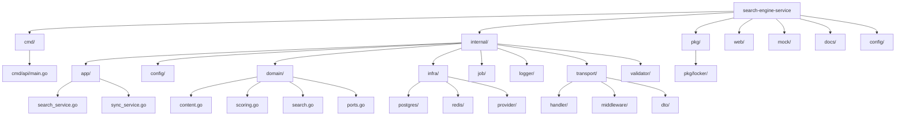

# Development Guide

This guide covers setup, testing, and contribution workflows.

## 🛠 Prerequisites

- **Go**: 1.25+
- **Docker**: For running Postgres/Redis dependencies
- **Make**: For automation

## 🚀 Quick Start

```bash
# 1. Download dependencies
make deps

# 2. Start Infrastructure (Postgres, Redis)
make docker-up

# 3. Run the Service
make run
```

## 📁 Project Structure



### Directory Details

| Directory                  | Purpose                                                          |
|----------------------------|------------------------------------------------------------------|
| `cmd/api/`                 | Application entry point, dependency injection, graceful shutdown |
| `internal/app/`            | Application services (use cases) - SearchService, SyncService    |
| `internal/config/`         | Configuration loading and management (Viper)                     |
| `internal/domain/`         | Core business entities, scoring logic, repository interfaces     |
| `internal/infra/postgres/` | PostgreSQL repository implementation, migrations                 |
| `internal/infra/redis/`    | Redis cache implementation                                       |
| `internal/infra/provider/` | External provider clients (Provider A, Provider B)               |
| `internal/job/`            | Background workers (sync scheduler)                              |
| `internal/transport/`      | HTTP handlers, middleware, request/response DTOs                 |
| `internal/validator/`      | Request validation wrapper                                       |
| `pkg/locker/`              | Reusable distributed lock package                                |
| `mock/`                    | Mock provider servers for local testing                          |
| `web/`                     | Dashboard assets (HTML templates, static files)                  |

---

## 🏃 Running Locally

### Option 1: Full Docker Stack

```bash
make docker-up
```

This starts everything: API, PostgreSQL, Redis, and mock providers.

### Option 2: Manual Local Development

If you prefer running the app locally (`go run`):

1. **Start Dependencies (DB & Redis)**:
    ```bash
    docker-compose up -d postgres redis
    ```

2. **Start Mock Providers**:
    ```bash
    make mock
    ```
   This starts two mock servers:
    - Provider A: `http://localhost:8081` (JSON API)
    - Provider B: `http://localhost:8082` (XML feed)

3. **Run API**:
    ```bash
    make run
    ```

### Mock Server Details

The mock servers simulate external content providers:

| Provider   | Port | Endpoint        | Format |
|------------|------|-----------------|--------|
| Provider A | 8081 | `/api/contents` | JSON   |
| Provider B | 8082 | `/feed`         | XML    |

To stop mock servers:

```bash
make mock-stop
```

---

## 🧪 Testing

We use a comprehensive testing strategy:

| Type            | Command                 | Description                             |
|-----------------|-------------------------|-----------------------------------------|
| **Unit**        | `make test-unit`        | Fast, isolated tests (Mocks, miniredis) |
| **Integration** | `make test-integration` | Real DB/Redis tests (Testcontainers)    |
| **Coverage**    | `make coverage`         | Generate HTML coverage report           |
| **Lint**        | `make lint`             | Run `golangci-lint`                     |

### Running Specific Tests

```bash
# Run tests for a specific package
go test -v ./internal/domain/...

# Run a specific test
go test -v ./internal/infra/postgres/... -run TestScoring

# Run with race detection
go test -race ./internal/...

# Run tests and generate coverage
go test -coverprofile=coverage.out ./...
go tool cover -html=coverage.out -o coverage.html
```

### Key Test Implementations

- **Ranking Algorithm**: `TestScoring` in `internal/infra/postgres` verifies the hybrid algorithm against a real
  PostgreSQL container
- **Validation**: Table-driven tests in `internal/transport/httpserver/dto` for request validation
- **Circuit Breaker**: Tests in `internal/infra/provider` verify circuit breaker state transitions
- **Distributed Lock**: Tests in `pkg/locker` use miniredis for Redis lock simulation

---

## 💻 Development Workflow

### Code Organization

When modifying the codebase:

1. **Domain Changes** (`internal/domain/`):
    - Modify entities or business logic
    - Update `internal/infra/postgres` for repository changes
    - Update mocks if interfaces change

2. **API Changes** (`internal/transport/`):
    - Add/update handlers
    - Add/update DTOs
    - Add validation tags

3. **New Provider** (`internal/infra/provider/`):
    - Create new provider package
    - Implement `domain.Provider` interface
    - Register in `provider/registry`

### Conventions

#### Code Style

- **Linting**: Must pass `golangci-lint` with zero warnings
- **Formatting**: Use `gofmt` (enforced by linter)
- **Naming**: Follow Go naming conventions
    - Package names: lowercase, single word when possible
    - Exported symbols: PascalCase
    - Private symbols: camelCase

#### Error Handling

- Always wrap errors with context: `fmt.Errorf("operation failed: %w", err)`
- Use structured logging for errors with context
- Never silently ignore errors

#### Context Usage

- Always accept `context.Context` as first parameter
- Respect context cancellation in long-running operations
- Pass context through to all external calls (DB, HTTP, Redis)

#### Testing

- Write table-driven tests for validation logic
- Use testcontainers for integration tests
- Mock external dependencies (HTTP, Redis) in unit tests

---

## 🔧 Useful Commands

| Command                 | Description                            |
|-------------------------|----------------------------------------|
| `make deps`             | Download Go dependencies               |
| `make run`              | Run the application locally            |
| `make build`            | Build binary to `bin/`                 |
| `make docker-up`        | Start all services with Docker Compose |
| `make docker-down`      | Stop all services                      |
| `make mock`             | Start mock provider servers            |
| `make mock-stop`        | Stop mock servers                      |
| `make test`             | Run all tests                          |
| `make test-unit`        | Run unit tests only (`-short` flag)    |
| `make test-integration` | Run integration tests only             |
| `make coverage`         | Generate HTML coverage report          |
| `make lint`             | Run linter                             |
| `make fmt`              | Format code                            |
| `make check`            | Run fmt, vet, lint, test               |
| `make swagger`          | Serve OpenAPI docs at localhost:8090   |

