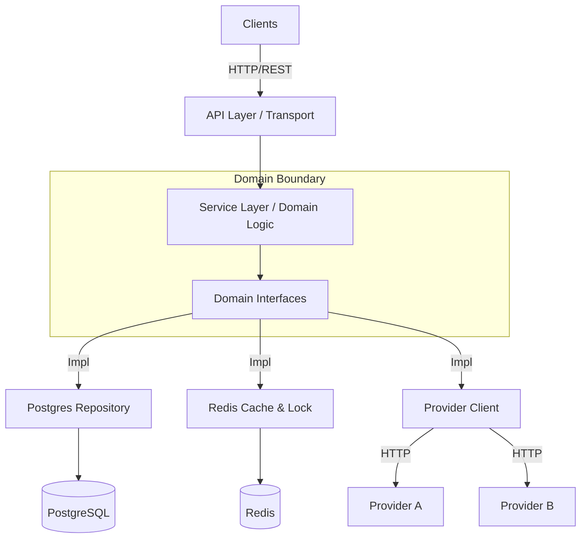

# Search Engine Service - Documentation Index

## Overview

The **Search Engine Service** is a high-performance microservice designed to aggregate, rank, and serve content. It
solves the problem of "viral but irrelevant" content by implementing a **Hybrid Ranking Algorithm** that balances
semantic text relevance (FTS) with engagement metrics.

## 🌟 Key Features

- **Hybrid Ranking**: Balances `ts_rank` (Title: A, Tags: B) with logarithmic popularity.
- **Distributed Consistency**: Uses `redsync` distributed locks for safe background synchronization.
- **Resilience**: Per-provider **Circuit Breakers** (`sony/gobreaker`) to handle external failures.
- **Performance**: Redis caching for hot searches and optimized GIN indexes for Postgres FTS.
- **Observability**: Structured logs (Zap) and Health Checks (`/livez`, `/readyz`).

---

## 📚 Documentation Map

| Document                                     | Description                                                                 |
|----------------------------------------------|-----------------------------------------------------------------------------|
| [**Architecture & Design**](ARCHITECTURE.md) | Deep dive into the Hybrid Ranking Logic, Circuit Breakers, and Data Flow.   |
| [**API Reference**](API.md)                  | Comprehensive list of endpoints, request parameters, and response examples. |
| [**Configuration**](CONFIGURATION.md)        | Env vars, Viper settings, and Secrets.                                      |
| [**Development**](DEVELOPMENT.md)            | Setup, testing strategies, and contribution guide.                          |
| [**Deployment**](DEPLOYMENT.md)              | Docker, Kubernetes specs, and Observability.                                |

---

## 🛠 Technology Stack

| Component            | Technology              | Version          | Role                                      |
|----------------------|-------------------------|------------------|-------------------------------------------|
| **Core**             | Go                      | 1.25             | Business Logic & Concurrency              |
| **Web Framework**    | Fiber                   | v2.52.10         | High-performance HTTP transport           |
| **Database**         | PostgreSQL              | -                | Persistence & Full-Text Search (tsvector) |
| **ORM**              | GORM                    | v1.31.1          | Database abstraction layer                |
| **Cache/Lock**       | Redis                   | go-redis v9.17.3 | Caching & Distributed Locking (RedSync)   |
| **Distributed Lock** | RedSync                 | v4.15.0          | Redis-based distributed locking (Redlock) |
| **Resilience**       | sony/gobreaker          | v2.4.0           | Circuit Breaker Pattern                   |
| **HTTP Client**      | Resty                   | v2.17.1          | HTTP client with retry & jitter           |
| **Configuration**    | Viper                   | v1.21.0          | Configuration management                  |
| **Logging**          | Zap                     | v1.27.1          | Structured logging                        |
| **Validation**       | go-playground/validator | v10.30.1         | Request validation                        |
| **Error Tracking**   | Sentry Go               | v0.42.0          | Error monitoring and tracing              |
| **Testing**          | Testify                 | v1.11.1          | Testing assertions and mocks              |
| **Testing**          | Testcontainers          | v0.40.0          | Integration tests with real containers    |
| **Migrations**       | Gormigrate              | v2.1.5           | Database schema migrations                |

---

## 🏗 Architecture Overview



The service follows **Ports & Adapters (Hexagonal)** architecture:

- **Domain Layer**: Pure business logic with no external dependencies
- **Application Layer**: Use cases (Search, Sync) orchestrating domain logic
- **Infrastructure Layer**: Adapters for Postgres, Redis, external providers
- **Transport Layer**: HTTP handlers, middleware, DTOs

---

## 🚀 Quick Start

### 1. Prerequisites

- Docker & Docker Compose
- Go 1.25+

### 2. Quick Start (Docker)

```bash
# Start the full stack (API, DB, Redis, Mock Providers)
make docker-up

# Verify
curl http://localhost:8080/livez
```

### 3. Access Dashboard

Open http://localhost:8080/dashboard in your browser for the web interface.

### 4. Local Development

If you prefer running the app locally (`go run`):

```bash
# 1. Start Database & Redis only
docker-compose up -d postgres redis

# 2. Start Mock Providers
make mock

# 3. Run the API
make run
```

---

## 📁 Project Structure

```
search-engine-service/
├── cmd/api/            # Entry point (Main)
├── internal/
│   ├── app/            # Application Services (Search, Sync)
│   ├── config/         # Configuration logic
│   ├── domain/         # Core Domain Entities & Interfaces
│   ├── infra/          # Infrastructure Adapters (Postgres, Redis)
│   ├── job/            # Background Workers
│   ├── logger/         # Logging setup
│   ├── transport/      # HTTP Handlers & Middlewares
│   └── validator/      # Request Validation
├── pkg/
│   └── locker/         # Reusable Distributed Lock pkg
├── api/                # OpenAPI specs
├── mock/               # Mock Providers for testing
├── web/                # Dashboard assets
└── docs/               # This documentation folder
```

---

## 🔌 Key Endpoints

| Endpoint                       | Method | Purpose                        |
|--------------------------------|--------|--------------------------------|
| `/livez`                       | GET    | Kubernetes liveness probe      |
| `/readyz`                      | GET    | Kubernetes readiness probe     |
| `/dashboard`                   | GET    | Web dashboard (Vue.js)         |
| `/api/v1/contents`             | GET    | Search content with pagination |
| `/api/v1/contents/:id`         | GET    | Get single content by ID       |
| `/api/v1/admin/sync`           | POST   | Trigger sync for all providers |
| `/api/v1/admin/sync/:provider` | POST   | Sync specific provider         |
| `/api/v1/admin/providers`      | GET    | List provider status           |

---

## 🧪 Testing

```bash
# Run all tests
make test

# Run unit tests only (fast, mocks)
make test-unit

# Run integration tests (real DB/Redis)
make test-integration

# Generate coverage report
make coverage

# Run linting
make lint
```

---

## 🔒 Distributed System Patterns

### Circuit Breakers

Per-provider circuit breakers (`sony/gobreaker`) prevent cascading failures:

- **Closed**: Normal operation
- **Open**: Fast-failing when provider is down
- **Half-Open**: Testing recovery before full restoration

### Distributed Locking

Redis-based distributed locks (`redsync`) ensure only one replica runs background sync:

- **Algorithm**: Redlock for safety across multiple Redis nodes
- **Lock Keys**: `sync:{provider_name}`
- **TTL**: Configured via `sync.timeout`

### Retry with Backoff

Resty HTTP client with exponential backoff + jitter:

- **Max Attempts**: 3 (configurable)
- **Wait Time**: Starts at 1s, exponentially increases
- **Jitter**: Random delay to prevent thundering herd
